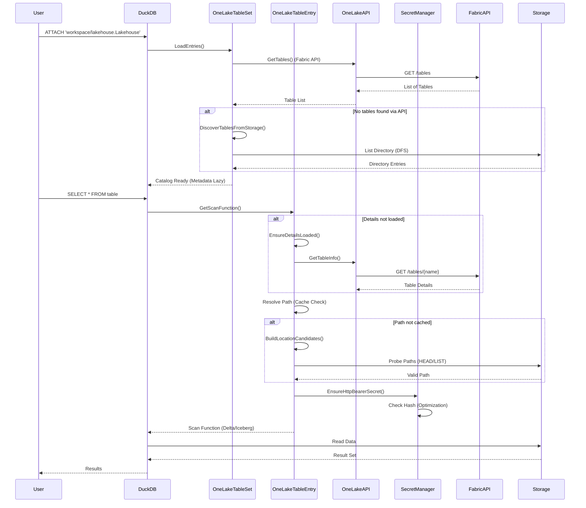
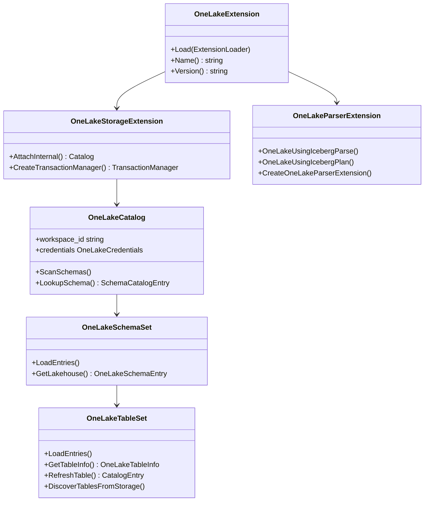
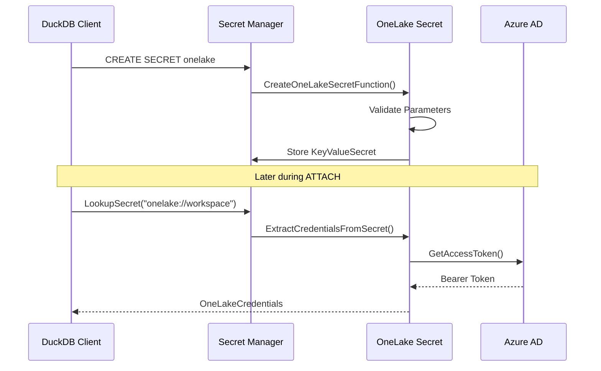
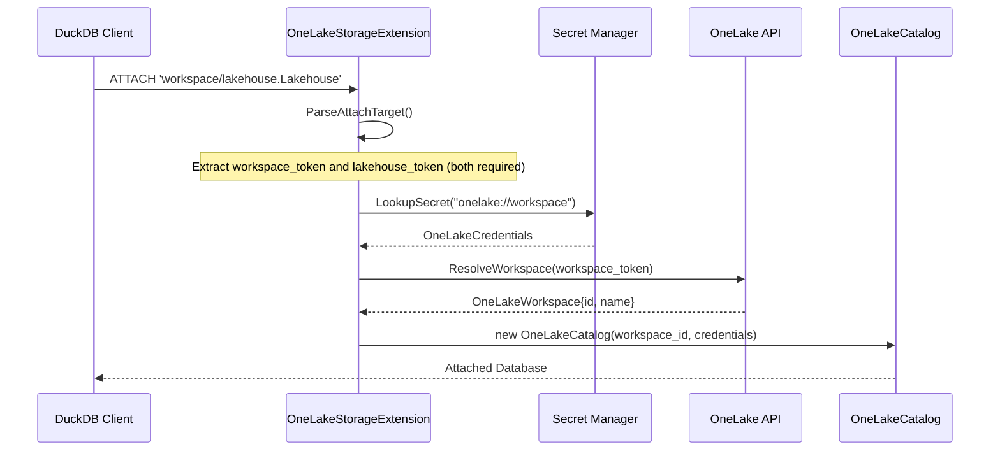
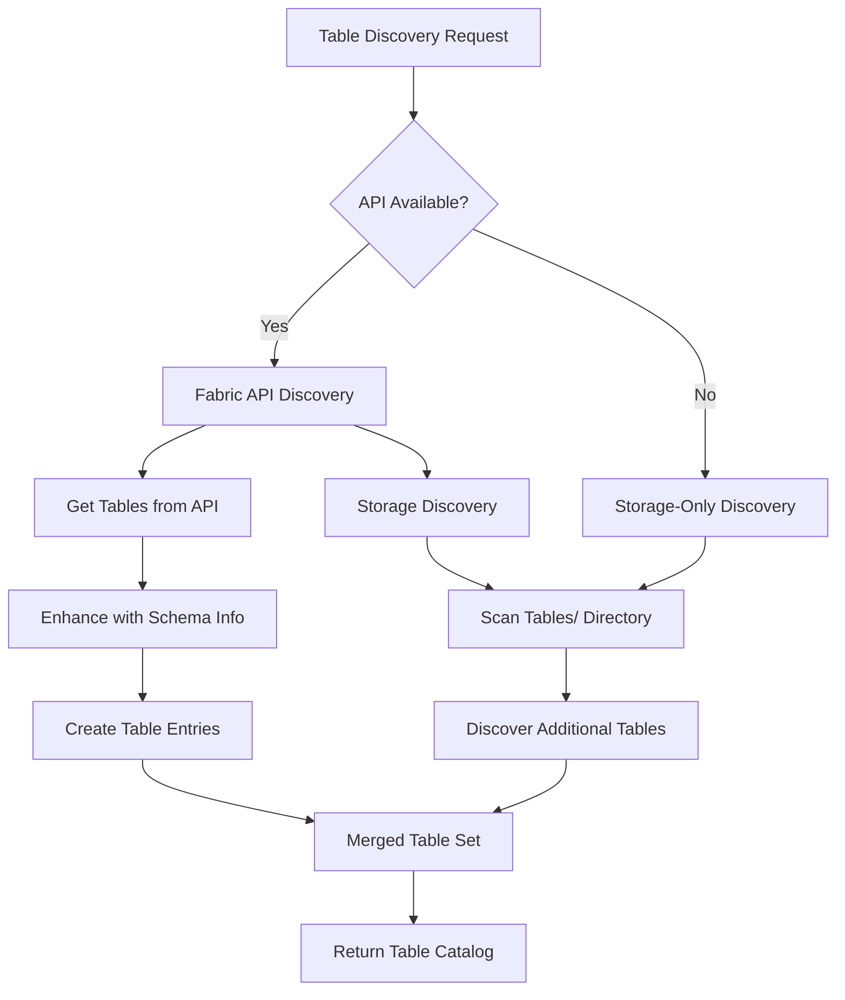
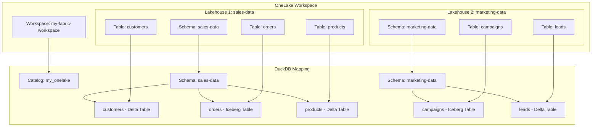
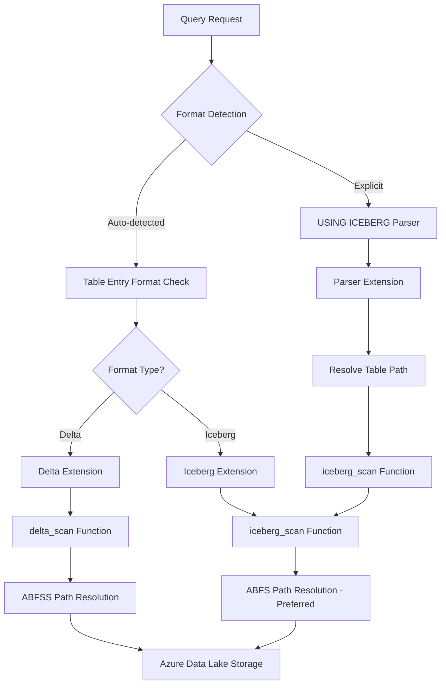
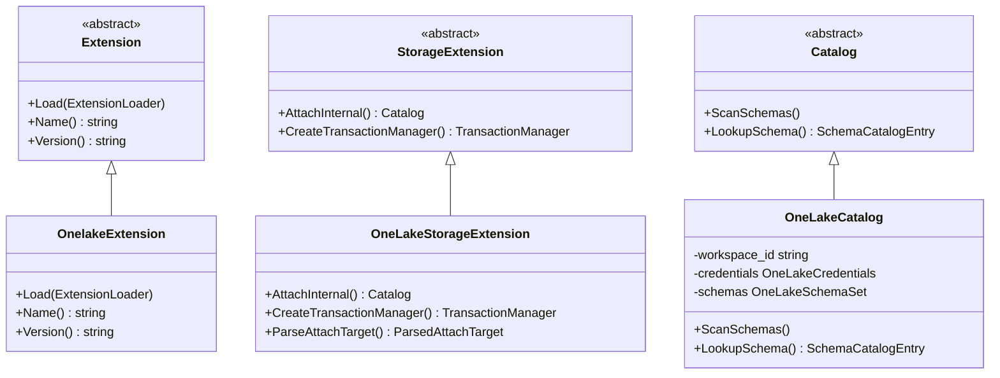
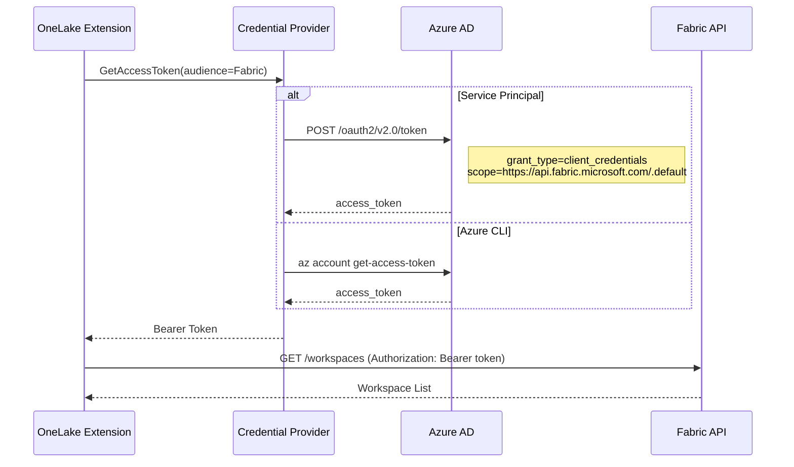
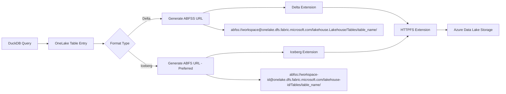

# DuckDB OneLake Extension Documentation

## Table of Contents
- [Overview](#overview)
- [Architecture](#architecture)
- [Authentication System](#authentication-system)
- [Database Attachment Process](#database-attachment-process)
- [Table Discovery and Selection](#table-discovery-and-selection)
- [Delta Write Pipeline](#delta-write-pipeline)
- [Apache Iceberg Support](#apache-iceberg-support)
- [Code Reference](#code-reference)
- [API Integration](#api-integration)
- [Limitations and Future Work](#limitations-and-future-work)

## Overview

The DuckDB OneLake extension enables seamless integration between DuckDB and Microsoft Fabric's OneLake, allowing users to query both Delta Lake and Apache Iceberg tables stored in OneLake lakehouses directly from DuckDB. In addition to querying, the extension now supports **append-only INSERT statements into existing Delta tables**, leveraging DuckDB's powerful SQL capabilities while maintaining secure authentication through Azure Active Directory.

### Key Features

- **Multiple Authentication Methods**: Service Principal credentials, Azure CLI authentication, credential chains, and env-token bootstrapping.
- **Workspace and Lakehouse Management**: Connect to multiple workspaces and lakehouses within a single DuckDB session.  
- **Multi-Format Support**: Native integration with both Delta Lake and Apache Iceberg formats (Iceberg is read-only today).
- **Schema Discovery**: Automatic discovery of lakehouses and tables within workspaces with lazy column hydration.
- **Advanced Query Syntax**: Support for explicit format specification with `USING ICEBERG` syntax.
- **Secure Access**: Full integration with Azure Active Directory for secure data access.
- **Delta DML Support**: `INSERT`, physical `CREATE TABLE`, `DROP TABLE`, `DELETE`, and `UPDATE` statements backed by the bundled Rust writer and OneLake storage APIs (no `RETURNING` clauses yet; destructive operations require an opt-in setting).

## Request Workflow

The following diagram illustrates the flow of a request from attachment to data retrieval, highlighting the performance optimizations:



## Architecture

The OneLake extension follows DuckDB's storage extension architecture, implementing a complete catalog system that maps OneLake concepts to DuckDB's catalog hierarchy:

- **Workspace** → **Catalog** (Database)  
- **Lakehouse** → **Schema**
- **Delta Table** → **Table**

### Core Components



### Extension Loading Process

The extension initialization occurs in the following sequence:

```cpp
// From: src/onelake_extension.cpp:12-23
static void LoadInternal(ExtensionLoader &loader) {
    // Register OneLake secret type
    RegisterOneLakeSecret(loader);

    // Register storage extension for catalog functionality
    auto &config = DBConfig::GetConfig(loader.GetDatabaseInstance());
    config.storage_extensions["onelake"] = make_uniq<OneLakeStorageExtension>();
    
    // Register parser extension for USING ICEBERG syntax
    config.parser_extensions.push_back(CreateOneLakeParserExtension());

    // Try to auto-load dependencies used for multi-format access
    ExtensionHelper::TryAutoLoadExtension(loader.GetDatabaseInstance(), "httpfs");
    ExtensionHelper::TryAutoLoadExtension(loader.GetDatabaseInstance(), "delta");
    ExtensionHelper::TryAutoLoadExtension(loader.GetDatabaseInstance(), "iceberg");
}
```

## Authentication System

The OneLake extension supports multiple authentication methods through a flexible credential system that integrates with Azure Active Directory.

### Authentication Methods

#### 1. Service Principal Authentication

The most common authentication method uses Azure AD Service Principal credentials:

```sql
CREATE SECRET onelake (
    TYPE ONELAKE,
    TENANT_ID '<your_tenant_id>',
    CLIENT_ID '<your_client_id>',
    CLIENT_SECRET '<your_client_secret>'
);
```

#### 2. Azure CLI Authentication  

Leverages existing Azure CLI authentication:

```sql
CREATE SECRET onelake (
    TYPE ONELAKE,
    PROVIDER credential_chain,
    CHAIN 'cli'
);
```

#### 3. Credential Chain

Supports multiple authentication fallback mechanisms:

```sql
CREATE SECRET onelake (
    TYPE ONELAKE,
    PROVIDER credential_chain,
    CHAIN 'cli;service_principal;managed_identity'
);
```

#### 4. Environment Token Authentication

If you already have OneLake/Fabric access tokens (for Fabric APIs or the DFS endpoint), store them in environment
variables and tell DuckDB to read from them via the credential chain. The variable names are configurable through the
extension options `onelake_env_fabric_token_variable` and `onelake_env_storage_token_variable` (defaults:
`FABRIC_API_TOKEN` and `AZURE_STORAGE_TOKEN`):

```sql
SET onelake_env_storage_token_variable = 'AZURE_STORAGE_TOKEN';
CREATE SECRET onelake_env (
    TYPE ONELAKE,
    PROVIDER credential_chain,
    CHAIN 'env'
);

-- Combine steps for resilience (CLI first, env fallback)
CREATE SECRET onelake_env_chain (
    TYPE ONELAKE,
    PROVIDER credential_chain,
    CHAIN 'cli, env'
);

-- Optional helper if you prefer not to export tokens at the shell level
SET VARIABLE AZURE_STORAGE_TOKEN = '<preissued_onelake_access_token>';
```

During secret creation the extension records the chosen variable names so that token resolution uses the right sources
even if the session settings change later. When Delta scans contact the DFS (`https://onelake.dfs...`) host, the
extension registers HTTP bearer secrets so each scope receives the token minted for the DFS audience. To optimize performance, the extension calculates a hash of the requested scopes and token; if the hash matches the last registered secret, the expensive registration step is skipped.

Each `ATTACH ... (TYPE ONELAKE)` run replays an env-aware bootstrap sequence:

- It tries to build a temporary OneLake secret named `__onelake_env_secret` whose credential chain is `env` so Fabric
    API calls can use the token pointed at by `onelake_env_fabric_token_variable` (default `FABRIC_API_TOKEN`).
- It also creates or refreshes an Azure access-token secret named `env_secret` (type `azure`, provider
    `access_token`) that reuses `onelake_env_storage_token_variable` (default `AZURE_STORAGE_TOKEN`) for DFS/ABFSS IO.

Token lookup prefers values from `SET VARIABLE <name>` over process-level environment variables so you can keep
credentials scoped to the current DuckDB session. Manual Azure secret creation is no longer required for the env-token
flow; the extension handles the refresh automatically. If one of the required variables is empty, the attach attempt
fails with a descriptive error that names the missing variable, eliminating ambiguous "no secret found" messages.

### Secret Management Implementation



The secret creation process is handled in the `CreateOneLakeSecretFunction`:

```cpp
// From: src/onelake_secret.cpp:9-40
static unique_ptr<BaseSecret> CreateOneLakeSecretFunction(ClientContext &context, CreateSecretInput &input) {
    auto scope = input.scope;
    if (scope.empty()) {
        scope.push_back("onelake://");
    }

    // Create key-value secret with OneLake credentials
    auto secret = make_uniq<KeyValueSecret>(scope, input.type, input.name, input.storage_type);

    string provider = input.provider.empty() ? "config" : StringUtil::Lower(input.provider);
    
    // Validate required parameters based on provider type
    if (provider == "service_principal") {
        // Validate tenant_id, client_id, client_secret are present
    } else if (provider == "credential_chain") {
        // Validate chain parameter and ensure 'cli' is included
    }
    
    return std::move(secret);
}
```

## Database Attachment Process

The attachment process establishes the connection between DuckDB and a specific OneLake workspace, creating a catalog that maps workspaces to databases and lakehouses to schemas.

### Attachment Syntax

```sql
-- Required format: workspace-name/lakehouse-name.Lakehouse
ATTACH 'workspace-name/lakehouse-name.Lakehouse' 
    AS my_onelake 
    (TYPE ONELAKE);
```

### Attachment Flow



Before the secret lookup happens the storage extension invokes `TryAutoCreateSecretsFromEnv()`. This helper inspects
the configured Fabric and DFS token variable names, tries to mint `__onelake_env_secret` and `env_secret` if the
tokens are present (from either `SET VARIABLE` or the process environment), and surfaces a tailored error when a
variable is unset. This ensures `ATTACH` can succeed with only pre-issued tokens and no manual Azure secret setup.

The attachment process begins in the `AttachInternal` method:

```cpp
// Simplified AttachInternal method - requires workspace/lakehouse.Lakehouse format
unique_ptr<Catalog> OneLakeStorageExtension::AttachInternal(
    optional_ptr<StorageExtensionInfo> storage_info,
    ClientContext &context, AttachedDatabase &db,
    const string &name, AttachInfo &info,
    AttachOptions &attach_options) {
    
    // Parse workspace and lakehouse from ATTACH target (required format)
    auto parsed_target = ParseAttachTarget(info.path.empty() ? name : info.path);
    string workspace_token = parsed_target.workspace_token;
    string default_lakehouse = parsed_target.lakehouse_token;
    
    // Look up appropriate secret based on workspace
    auto &secret_manager = SecretManager::Get(context);
    auto secret_candidate_path = "onelake://" + workspace_token;
    auto secret_match = secret_manager.LookupSecret(
        catalog_transaction, secret_candidate_path, "onelake");
    
    // Extract and validate credentials
    OneLakeCredentials credentials = ExtractCredentialsFromSecret(secret_match.GetSecret());
    
    // Resolve workspace name/ID through API
    OneLakeWorkspace resolved_workspace = ResolveWorkspace(context, credentials, workspace_token);
    
    return make_uniq<OneLakeCatalog>(db, resolved_workspace.id, name, 
                                     std::move(credentials), std::move(default_lakehouse));
}
```

### Target Parsing Logic

The extension requires a specific attachment format through the `ParseAttachTarget` function:

```cpp
// Simplified ParseAttachTarget - requires workspace/lakehouse.Lakehouse format
static ParsedAttachTarget ParseAttachTarget(const string &raw_identifier) {
    // Validate the required format: workspace-name/lakehouse-name.Lakehouse
    auto slash_pos = working.find('/');
    if (slash_pos == string::npos) {
        throw InvalidInputException("OneLake ATTACH path must be in format 'workspace-name/lakehouse-name.Lakehouse'");
    }
    
    string workspace_part = working.substr(0, slash_pos);
    string lakehouse_part = working.substr(slash_pos + 1);
    
    // Validate no additional path segments
    if (lakehouse_part.find('/') != string::npos) {
        throw InvalidInputException("OneLake ATTACH path must be in format 'workspace-name/lakehouse-name.Lakehouse'");
    }
    
    // Normalize lakehouse name (remove .Lakehouse suffix if present)
    result.workspace_token = workspace_part;
    result.lakehouse_token = NormalizeLakehouseToken(lakehouse_part);
    result.has_lakehouse = true;
    
    return result;
}
```

## Table Discovery and Selection

The extension implements a two-phase table discovery mechanism that combines Fabric API calls with direct storage exploration to provide comprehensive table listing.

### Discovery Architecture



### Table Loading Process

### Table Loading Process

The table loading process is implemented in the `OneLakeTableSet::LoadEntries` method. To optimize performance, the extension employs a lazy loading strategy and gates expensive storage discovery:

```cpp
// From: src/storage/onelake_table_set.cpp
void OneLakeTableSet::LoadEntries(ClientContext &context) {
    // Phase 1: Get tables from OneLake API
    // This only fetches the list of tables and basic metadata.
    // Detailed metadata (schema, partitions) is fetched lazily upon access.
    auto tables = OneLakeAPI::GetTables(context, ...);
    
    idx_t api_count = 0;
    for (auto &table : tables) {
        // Create entry with basic info; details loaded later
        CreateEntry(std::move(table_entry));
        api_count++;
    }
    
    // Phase 2: Discover additional tables from storage (DFS Fallback)
    // Only performed if API returns no tables to avoid unnecessary network calls
    if (api_count == 0) {
        DiscoverTablesFromStorage(context, ...);
    }
}
```

### API-Based Table Discovery

### API-Based Table Discovery

The Fabric API provides structured table metadata through REST endpoints:

```cpp
// From: src/onelake_api.cpp:420-460
vector<OneLakeTable> OneLakeAPI::GetTables(ClientContext &context, 
                                          const string &workspace_id,
                                          const string &lakehouse_id, 
                                          OneLakeCredentials &credentials) {
    vector<OneLakeTable> tables;
    string next_url = BuildAPIUrl(workspace_id, "lakehouses/" + lakehouse_id + "/tables");
    
    while (!next_url.empty()) {
        string response = MakeAPIRequest(context, next_url, credentials, true);
        
        // Parse JSON response
        Json::Value root;
        Json::Reader reader;
        reader.parse(response, root);
        
        // Extract table information
        if (root.isMember("value") && root["value"].isArray()) {
            for (const auto &item : root["value"]) {
                OneLakeTable table;
                table.name = item["name"].asString();
                table.id = item["id"].asString();
                table.format = item["format"].asString();
                table.location = item["location"].asString();
                tables.push_back(table);
            }
        }
        
        // Handle pagination
        next_url = root.isMember("@odata.nextLink") ? 
                   root["@odata.nextLink"].asString() : "";
    }
    
    return tables;
}
```

### Storage-Based Discovery

When API access is limited or to discover tables not yet registered in the API, the extension scans the storage directly:

```cpp
// Storage discovery examines the Tables/ directory structure
// Looking for Delta Lake table directories with _delta_log subdirectories
static idx_t DiscoverTablesFromStorage(ClientContext &context, 
                                       OneLakeCatalog &onelake_catalog,
                                       OneLakeSchemaEntry &schema, 
                                       OneLakeTableSet &table_set,
                                       std::unordered_set<string> &seen_names) {
    
    // Construct ABFSS path for Tables directory
    string tables_path = "abfss://Tables@" + workspace_name + 
                        ".dfs.fabric.microsoft.com/";
    
    // List directory contents
    auto entries = OneLakeAPI::ListDirectory(context, tables_path, credentials);
    
    idx_t count = 0;
    for (const string &entry : entries) {
        // Check if entry looks like a table directory
        if (seen_names.find(StringUtil::Lower(entry)) == seen_names.end()) {
            // Verify it's a valid Delta table by checking for _delta_log
            string delta_log_path = tables_path + entry + "/_delta_log/";
            if (DirectoryExists(context, delta_log_path, credentials)) {
                // Create table entry for discovered table
                auto table_entry = make_uniq<OneLakeTableEntry>(
                    catalog, schema, entry, "", "delta", "Tables/" + entry);
                table_set.CreateEntry(std::move(table_entry));
                count++;
            }
        }
    }
    
    return count;
}
```

### Table Information Retrieval

For each discovered table, the extension retrieves detailed metadata lazily when the table is first accessed:

```cpp
// From: src/storage/onelake_table_entry.cpp
void OneLakeTableEntry::EnsureDetailsLoaded(ClientContext &context) {
    if (details_loaded) return;

    // Fetch detailed info (location, partitions) from API
    auto table_info = OneLakeAPI::GetTableInfo(...);
    
    if (table_info.has_metadata) {
        table_data->location = table_info.location;
        SetPartitionColumns(table_info.partition_columns);
    }
    
    details_loaded = true;
}

TableFunction OneLakeTableEntry::GetScanFunction(...) {
    EnsureDetailsLoaded(context);
    // ... proceed to bind scan function ...
}
```

### Schema and Table Hierarchy



## Delta Write Pipeline

The write subsystem now covers `INSERT`, `CREATE TABLE`, `DROP TABLE`, `DELETE`, and `UPDATE`. This section summarizes
the main flows and the knobs that govern them.

### INSERT and write-mode settings

`INSERT` reuse DuckDB's planning pipeline with a bespoke `PhysicalOneLakeInsert` operator that batches rows and hands
them to the Rust `deltalake` writer:

1. **Planner hook** – Tables bound inside a OneLake catalog swap `PhysicalInsert` for `PhysicalOneLakeInsert` without
        changing the logical children, so complex `INSERT ... SELECT` pipelines still run inside DuckDB.
2. **Buffering** – Each thread appends incoming chunks into a shared `ColumnDataCollection`, preserving column names
        captured during catalog load so the Arrow schema matches the Delta table exactly.
3. **Finalize** – `PhysicalOneLakeInsert::Finalize` resolves the ABFSS URI, serializes partition columns, and packages
        credentials plus options JSON (write mode, schema mode, safe-cast preferences, file/batch hints).
4. **Rust hand-off** – `OneLakeDeltaWriter::Append` wraps the buffered data in an `ArrowArrayStream` and calls
        `ol_delta_append`. The Rust crate registers Azure handlers, opens the table via `DeltaOps`, and streams the batches.
5. **Row count output** – The operator emits a single row containing the number of inserted tuples so shells and
        parameterized clients can observe write cardinality.

Configuration settings:

- `onelake_insert_mode = append|overwrite|error_if_exists|ignore`
- `onelake_schema_mode = merge|overwrite`
- `onelake_safe_cast = true|false`
- `onelake_target_file_size` (`BIGINT` bytes) and `onelake_write_batch_size` (rows) for performance tuning

#### Reference SQL examples (current feature set)

```sql
-- Create a Delta table that materializes immediately with partition metadata
CREATE TABLE finance.daily_balances (
    account_id BIGINT,
    region VARCHAR,
    as_of_date DATE,
    balance DECIMAL(18,2)
) PARTITION BY (region, as_of_date)
WITH (
    description = 'Daily regional balances'
);

-- Append or overwrite data with explicit write-mode controls
SET onelake_insert_mode = 'append';
SET onelake_schema_mode = 'merge';
INSERT INTO finance.daily_balances
SELECT account_id, region, as_of_date, balance FROM staging_balances;

-- Update rows (requires destructive-operation opt-in)
SET onelake_allow_destructive_operations = true;
UPDATE finance.daily_balances
SET balance = balance * 1.02
WHERE region = 'EMEA' AND as_of_date = DATE '2025-11-28';

-- Delete rows that fall outside your retention window
SET onelake_allow_destructive_operations = true;
DELETE FROM finance.daily_balances
WHERE as_of_date < DATE '2025-01-01';

-- Drop a table when the catalog entry should be removed
SET onelake_allow_destructive_operations = true;
DROP TABLE IF EXISTS finance.archived_balances;
```

All destructive statements (`UPDATE`, `DELETE`, `DROP TABLE`) require the session-scoped
`onelake_allow_destructive_operations` flag. Partition columns specified via `PARTITION BY (...)` (or by manually
setting `onelake_partition_columns`) are persisted directly into the Delta metadata so downstream systems see the same
layout.

### CREATE TABLE (Phase 2)

`CREATE TABLE ...` now has two responsibilities:

1. Record the catalog metadata via `OneLakeTableSet::CreateTable`, just like standard DuckDB schemas.
2. Call into the Rust writer (`OneLakeDeltaWriter::CreateTable`) to materialize a Delta table under
     `abfss://<workspace>@onelake.dfs.fabric.microsoft.com/<lakehouse_id>/Tables/<table>/` (or an explicit location tag).

Partition columns are derived from tags, comments, or the `onelake_partition_columns` session setting and serialized
into the options payload passed to Rust.

### DROP TABLE, DELETE, UPDATE (Phases 3-5)

- **Safety toggle** – All destructive operations obey `onelake_allow_destructive_operations`, which defaults to
    `false`. Users must `SET onelake_allow_destructive_operations = true;` per session before running `DROP TABLE`,
    `DELETE`, or `UPDATE`.
- **DROP TABLE** – `PhysicalOneLakeDrop` removes the catalog entry and calls into the Rust bridge to delete Delta
    metadata in the catalog, but it currently **does not delete** the physical folders or `_delta_log` directories in the
    OneLake lakehouse. Operators should clean up storage via Fabric tooling if needed.
- **DELETE** – `PhysicalOneLakeDelete` captures the predicate, serializes it into Delta SQL, and invokes a Rust FFI
    method that issues a Delta delete command. The operator returns the count of deleted rows. `RETURNING` is not yet
    supported.
- **UPDATE** – `PhysicalOneLakeUpdate` captures the `SET` clause and WHERE predicate, serializes them into JSON, and
    reuses the Rust bridge to perform the read-modify-write cycle. Only non-returning updates are supported today.

### Payloads passed to the writer

- **Table URI** – An ABFSS location such as
    `abfss://workspace@onelake.dfs.fabric.microsoft.com/lakehouse.Lakehouse/Tables/people`.
- **Token JSON** – `{ "storageToken": "<dfs_scope_token>" }`, reused by `httpfs` and the Rust writer.
- **Options JSON** – `{ "mode": "append", "schemaMode": "merge", "partitionColumns": [ ... ] }`, plus
    operation-specific keys (`predicate`, `assignments`, etc.).

### Operational notes

- Only Delta tables are writable today; Iceberg remains read-only.
- MERGE/UPSERT and ALTER TABLE flows are still under development.
- If table schemas change externally, re-run `ATTACH` (or `DETACH/ATTACH`) to refresh column metadata before writing.

## Apache Iceberg Support

The OneLake extension provides comprehensive support for Apache Iceberg tables alongside traditional Delta Lake tables. This enables users to query Iceberg tables stored in OneLake lakehouses using either automatic format detection or explicit syntax.

### Iceberg Integration Architecture



### Format Detection Process

The extension automatically detects table formats during discovery by inspecting the storage structure:

```cpp
// From: src/storage/onelake_table_set.cpp:137-163
bool has_delta_log = false;
bool has_iceberg_metadata = false;

// Check for Delta format (_delta_log directory)
if (!has_delta_log) {
    try {
        string delta_dir = root + leaf + "/_delta_log/";
        auto delta_entries = OneLakeAPI::ListDirectory(context, delta_dir, credentials);
        has_delta_log = !delta_entries.empty();
    } catch (const Exception &) {
        has_delta_log = false;
    }
}

// Check for Iceberg format (metadata directory)  
if (!has_delta_log) {
    try {
        string table_root = root + leaf + "/";
        auto child_dirs = OneLakeAPI::ListDirectory(context, table_root, credentials);
        for (auto &child : child_dirs) {
            if (StringUtil::CIEquals(child, "metadata")) {
                has_iceberg_metadata = true;
                break;
            }
        }
    } catch (const Exception &) {
        has_iceberg_metadata = false;
    }
}

string detected_format = has_delta_log ? "Delta" : "iceberg";
```

### Query Syntax Options

#### 1. Automatic Format Detection (Recommended)

Tables are automatically recognized by their format based on storage structure:

```sql
-- Standard catalog access - format auto-detected
SELECT * FROM onelake_catalog.lakehouse_name.table_name;

-- Cross-catalog joins with mixed formats
SELECT d.*, i.* 
FROM onelake_catalog.sales.delta_table d
JOIN onelake_catalog.analytics.iceberg_table i ON d.id = i.ref_id;
```

#### 2. Explicit Iceberg Syntax

For cases requiring explicit format specification or direct table access:

```sql
-- Basic table access
SELECT * FROM table_name USING ICEBERG;

-- Schema-qualified access  
SELECT * FROM lakehouse_name.table_name USING ICEBERG;

-- Fully qualified access
SELECT * FROM catalog_name.lakehouse_name.table_name USING ICEBERG;
```

### Parser Extension Implementation

The `USING ICEBERG` syntax is handled by a dedicated parser extension:

```cpp
// From: src/onelake_parser_extension.cpp:45-70
ParserExtensionParseResult OneLakeUsingIcebergParse(ParserExtensionInfo *, const string &query) {
    auto normalized = TrimmedWithoutSemicolon(query);
    auto upper = StringUtil::Upper(normalized);
    
    const string prefix = "SELECT * FROM ";
    const string suffix = " USING ICEBERG";
    
    if (!StringUtil::StartsWith(upper, prefix) || !StringUtil::EndsWith(upper, suffix)) {
        return ParserExtensionParseResult();
    }
    
    // Extract table identifier between prefix and suffix
    auto identifier = normalized.substr(prefix.size(), 
                                       normalized.size() - prefix.size() - suffix.size());
    
    OneLakeIcebergParseData parse_data;
    if (!TryParseQualifiedName(identifier, parse_data)) {
        return ParserExtensionParseResult();
    }
    
    return ParserExtensionParseResult(std::move(parse_data));
}
```

The parser extension translates `USING ICEBERG` queries into direct `iceberg_scan` function calls with properly constructed ABFSS paths.

### Iceberg Function Integration

The extension dynamically resolves and binds to the DuckDB Iceberg extension:

```cpp
// From: src/storage/onelake_table_entry.cpp:221-236
TableFunction ResolveIcebergFunction(ClientContext &context) {
    auto table_entry = Catalog::GetEntry<TableFunctionCatalogEntry>(
        context, INVALID_CATALOG, DEFAULT_SCHEMA, ICEBERG_FUNCTION_NAME, OnEntryNotFound::RETURN_NULL);
    
    if (!table_entry) {
        ExtensionHelper::AutoLoadExtension(context, "iceberg");
        table_entry = Catalog::GetEntry<TableFunctionCatalogEntry>(
            context, INVALID_CATALOG, DEFAULT_SCHEMA, ICEBERG_FUNCTION_NAME, OnEntryNotFound::RETURN_NULL);
    }
    
    if (!table_entry) {
        throw CatalogException(
            "The 'iceberg' extension is required to query OneLake tables in Iceberg format. "
            "Install it using INSTALL iceberg; then LOAD iceberg;");
    }
    
    return table_entry->functions.GetFunctionByOffset(0);
}
```

### Path Resolution for Iceberg Tables

Iceberg tables use optimized ABFS path resolution that prioritizes native OneLake paths:

```cpp
// From: src/storage/onelake_table_entry.cpp:350-370
if (IsIcebergFormat(table_format)) {
    auto iceberg_function = ResolveIcebergFunction(context);
    
    // Prioritize ABFS paths for better Iceberg compatibility
    auto is_abfs = [](const string &candidate) {
        return StringUtil::StartsWith(candidate, "abfs://") || 
               StringUtil::StartsWith(candidate, "abfss://");
    };
    std::stable_partition(candidate_paths.begin(), candidate_paths.end(), is_abfs);
    
    // Try each path candidate until successful binding
    vector<string> errors;
    for (auto &candidate : candidate_paths) {
        try {
            vector<LogicalType> return_types;
            vector<string> return_names;
            auto iceberg_bind = BindIcebergFunction(context, iceberg_function, 
                                                   candidate, return_types, return_names);
            UpdateColumnDefinitions(return_names, return_types);
            bind_data = std::move(iceberg_bind);
            return iceberg_function;
        } catch (const Exception &ex) {
            errors.push_back(StringUtil::Format("%s (path=%s)", ex.what(), candidate));
        }
    }
}
```

### ABFSS Path Construction

The extension constructs proper ABFSS paths for OneLake Iceberg table access:

```cpp
// From: src/onelake_parser_extension.cpp:17-20
string BuildAbfssPath(const string &workspace_id, const string &lakehouse_id, const string &table_name) {
    return "abfss://" + workspace_id + "@onelake.dfs.fabric.microsoft.com/" + 
           lakehouse_id + "/Tables/" + table_name;
}
```

Path format: `abfss://{workspace-id}@onelake.dfs.fabric.microsoft.com/{lakehouse-id}/Tables/{table-name}`

### Multi-Format Query Examples

```sql
-- Query both Delta and Iceberg tables in same workspace
USE onelake_catalog;

-- Auto-detected formats
SELECT 'Delta' as format, COUNT(*) FROM sales_data.orders_delta
UNION ALL  
SELECT 'Iceberg' as format, COUNT(*) FROM analytics.customer_iceberg;

-- Explicit format specification for clarity
SELECT * FROM customer_data USING ICEBERG 
WHERE region = 'North America';

-- Complex joins across formats
WITH delta_summary AS (
    SELECT product_id, SUM(quantity) as total_qty 
    FROM sales.transactions_delta 
    GROUP BY product_id
),
iceberg_enriched AS (
    SELECT product_id, category, brand 
    FROM catalog.products_iceberg
    WHERE active = true
)
SELECT d.product_id, d.total_qty, i.category, i.brand
FROM delta_summary d
JOIN iceberg_enriched i ON d.product_id = i.product_id;
```

### Error Handling and Dependencies

The Iceberg integration includes comprehensive error handling:

```sql
-- Automatic extension loading
LOAD onelake; -- Automatically attempts to load 'iceberg' extension

-- Manual installation if needed
INSTALL iceberg;
LOAD iceberg;
```

Common error scenarios:
- **Missing Iceberg Extension**: Clear instructions for installation
- **Invalid Table Path**: Multiple path resolution attempts with detailed error reporting  
- **Authentication Issues**: Inherited from main OneLake authentication system
- **Format Conflicts**: Automatic fallback and format detection

## Code Reference

### Key Source Files

#### Extension Entry Point
- **File**: `src/onelake_extension.cpp`
- **Purpose**: Main extension registration and dependency loading
- **Key Functions**:
  - `LoadInternal()`: Registers secrets, storage extension, and dependencies
  - `OnelakeExtension::Load()`: Extension loader interface

#### Storage Extension  
- **File**: `src/storage/onelake_storage_extension.cpp`
- **Purpose**: Implements DuckDB storage extension interface
- **Key Functions**:
  - `AttachInternal()`: Handles ATTACH statement processing
  - `CreateTransactionManager()`: Creates OneLake-specific transaction manager
  - `ParseAttachTarget()`: Parses attachment strings

#### Catalog System
- **File**: `src/onelake_catalog.cpp` 
- **Purpose**: Implements OneLake catalog (workspace) functionality
- **Key Functions**:
  - `OneLakeCatalog()`: Constructor with workspace and credentials
  - `LookupSchema()`: Maps lakehouse names to schema entries
  - `ScanSchemas()`: Enumerates available lakehouses

#### Authentication
- **File**: `src/onelake_secret.cpp`
- **Purpose**: Manages OneLake authentication secrets
- **Key Functions**:
  - `CreateOneLakeSecretFunction()`: Creates and validates secrets
  - `RegisterOneLakeSecret()`: Registers secret type with DuckDB

#### API Integration
- **File**: `src/onelake_api.cpp` 
- **Purpose**: Interfaces with Microsoft Fabric REST APIs
- **Key Functions**:
  - `GetWorkspaces()`: Lists available workspaces
  - `GetLakehouses()`: Lists lakehouses in workspace  
  - `GetTables()`: Lists tables in lakehouse
  - `MakeAPIRequest()`: HTTP client for Fabric APIs

#### Table Management
- **File**: `src/storage/onelake_table_set.cpp`
- **Purpose**: Manages table discovery and metadata
- **Key Functions**:
  - `LoadEntries()`: Discovers tables via API and storage
  - `GetTableInfo()`: Retrieves detailed table metadata
  - `RefreshTable()`: Updates table information
  - `DiscoverTablesFromStorage()`: Multi-format table detection (Delta/_delta_log, Iceberg/metadata)

#### Parser Extension (Iceberg Support)
- **File**: `src/onelake_parser_extension.cpp`
- **Purpose**: Handles `USING ICEBERG` syntax parsing and planning
- **Key Functions**:
  - `OneLakeUsingIcebergParse()`: Parses `SELECT * FROM table USING ICEBERG` syntax
  - `OneLakeUsingIcebergPlan()`: Plans iceberg_scan function calls with ABFSS paths
  - `CreateOneLakeParserExtension()`: Registers parser extension with DuckDB

#### Table Entry (Multi-Format Support)
- **File**: `src/storage/onelake_table_entry.cpp`
- **Purpose**: Handles both Delta and Iceberg table scanning
- **Key Functions**:
  - `ResolveIcebergFunction()`: Auto-loads iceberg extension and resolves iceberg_scan
  - `BindIcebergFunction()`: Binds Iceberg tables with proper ABFSS paths  
  - `IsIcebergFormat()` / `IsDeltaFormat()`: Format detection helpers
  - `GetScanFunction()`: Multi-format scan function resolution with path prioritization

### Class Hierarchy



## API Integration

The extension integrates with Microsoft Fabric APIs to discover and access OneLake resources.

### Authentication Flow



### Fabric API Endpoints

The extension uses these primary Fabric API endpoints:

| Endpoint | Purpose | Implementation |
|----------|---------|----------------|
| `GET /v1/workspaces` | List accessible workspaces | `OneLakeAPI::GetWorkspaces()` |
| `GET /v1/workspaces/{workspaceId}/items` | List items in workspace | Used to find lakehouses |
| `GET /v1/workspaces/{workspaceId}/lakehouses/{lakehouseId}/tables` | List tables in lakehouse | `OneLakeAPI::GetTables()` |
| `GET /v1/workspaces/{workspaceId}/lakehouses/{lakehouseId}/tables/{tableName}` | Get table details | `OneLakeAPI::GetTableInfo()` |

### HTTP Request Implementation

```cpp
// From: src/onelake_api.cpp - HTTP client implementation
static string MakeAPIRequest(ClientContext &context, const string &url, 
                           OneLakeCredentials &credentials, bool expect_json = true) {
    CURL *curl = curl_easy_init();
    string response;
    
    // Set URL and headers
    curl_easy_setopt(curl, CURLOPT_URL, url.c_str());
    
    // Get access token and set authorization header
    string token = GetAccessToken(&context, credentials, OneLakeTokenAudience::Fabric);
    string auth_header = "Authorization: Bearer " + token;
    
    struct curl_slist *headers = nullptr;
    headers = curl_slist_append(headers, auth_header.c_str());
    headers = curl_slist_append(headers, "Content-Type: application/json");
    
    curl_easy_setopt(curl, CURLOPT_HTTPHEADER, headers);
    curl_easy_setopt(curl, CURLOPT_WRITEFUNCTION, WriteCallback);
    curl_easy_setopt(curl, CURLOPT_WRITEDATA, &response);
    
    // Perform request
    CURLcode res = curl_easy_perform(curl);
    
    // Cleanup
    curl_slist_free_all(headers);
    curl_easy_cleanup(curl);
    
    return response;
}
```

### Data Lake Storage Access

For actual table data access, the extension constructs ABFSS URLs and delegates to appropriate format extensions:



The ABFSS URL construction follows these patterns:

**Delta Tables (Legacy format)**:
```
abfss://{workspace-name}@onelake.dfs.fabric.microsoft.com/{lakehouse-name}.Lakehouse/Tables/{table-name}/
```

**Iceberg Tables (Optimized format)**:
```
abfss://{workspace-id}@onelake.dfs.fabric.microsoft.com/{lakehouse-id}/Tables/{table-name}/
```

The Iceberg integration prioritizes native ABFS paths for better compatibility with the Iceberg format specification.

## Limitations and Future Work

### Current Limitations

1. **Delta-only writes**: All DML (`INSERT`, `CREATE TABLE`, `DROP TABLE`, `DELETE`, `UPDATE`) targets Delta tables. Iceberg remains read-only.
2. **Destructive operations**: `DROP TABLE` currently removes only the DuckDB catalog entry. It does **not** delete the underlying directories or `_delta_log` files inside the OneLake lakehouse, even when those folders are empty.
3. **Schema-enabled lakehouses**: Attach attempts still fail because the Fabric API does not expose a stable contract yet (see the [public preview limitations](https://learn.microsoft.com/en-us/fabric/data-engineering/lakehouse-schemas#public-preview-limitations)).
4. **Feature gaps**: MERGE/UPSERT, ALTER TABLE (add/drop column), and `RETURNING` clauses for DELETE/UPDATE are planned but not implemented.
5. **Limited metadata**: Some table-level statistics (row counts, data sizes) are unavailable through the current APIs.

---

#### DELETE/UPDATE Troubleshooting

- Always set `SET onelake_allow_destructive_operations = true;` before running DELETE, UPDATE, or DROP TABLE.
- `RETURNING` clauses are not yet supported. If DuckDB reports "operator not supported" or similar planner errors, remove `RETURNING` and rerun the statement.
- Ensure you are on the latest build: the physical operators avoid child scans, so outdated binaries may still reference removed planner paths.
- If failures persist, capture the DuckDB `EXPLAIN` plan plus the extension logs and share them with the maintainers.

### Future Enhancements

#### Extended Write Operations
- Support for Iceberg inserts, CTAS, and overwrite modes
- Declarative MERGE/UPDATE/DELETE once the Fabric APIs and storage semantics are available

#### Enhanced Authentication
- Managed Identity support for Azure-hosted environments
- Interactive authentication flows
- Certificate-based authentication

#### Performance Optimizations
- Connection pooling for API requests
- Metadata caching with TTL
- Parallel table discovery
- Predicate pushdown optimization

#### Extended Format Support
- Direct Parquet table support
- CSV file access within lakehouses  
- JSON data file support
- Hudi table format integration
- Mixed format query optimization

### Error Handling and Reliability

The extension implements comprehensive error handling:

```cpp
// Example error handling patterns from the codebase
try {
    auto tables = OneLakeAPI::GetTables(context, workspace_id, lakehouse_id, credentials);
} catch (const std::exception &e) {
    // Fallback to storage-based discovery
    if (detail_endpoint_supported) {
        detail_endpoint_supported = false;
        // Log warning and continue with alternative approach
    }
}
```

Common error scenarios handled:
- Network connectivity issues
- Authentication token expiration
- API rate limiting  
- Workspace/lakehouse access permissions
- Malformed table metadata

This comprehensive documentation provides a complete understanding of the DuckDB OneLake extension's architecture, functionality, and implementation details. The extension serves as a bridge between DuckDB's powerful analytical capabilities and Microsoft Fabric's OneLake data platform, enabling seamless data analysis workflows.