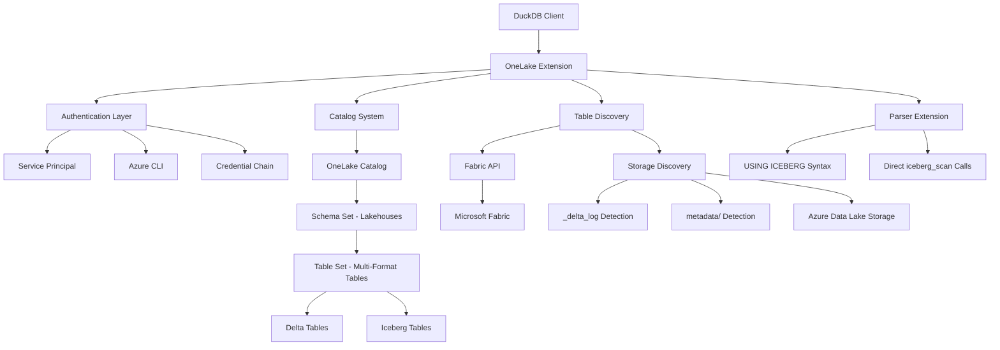
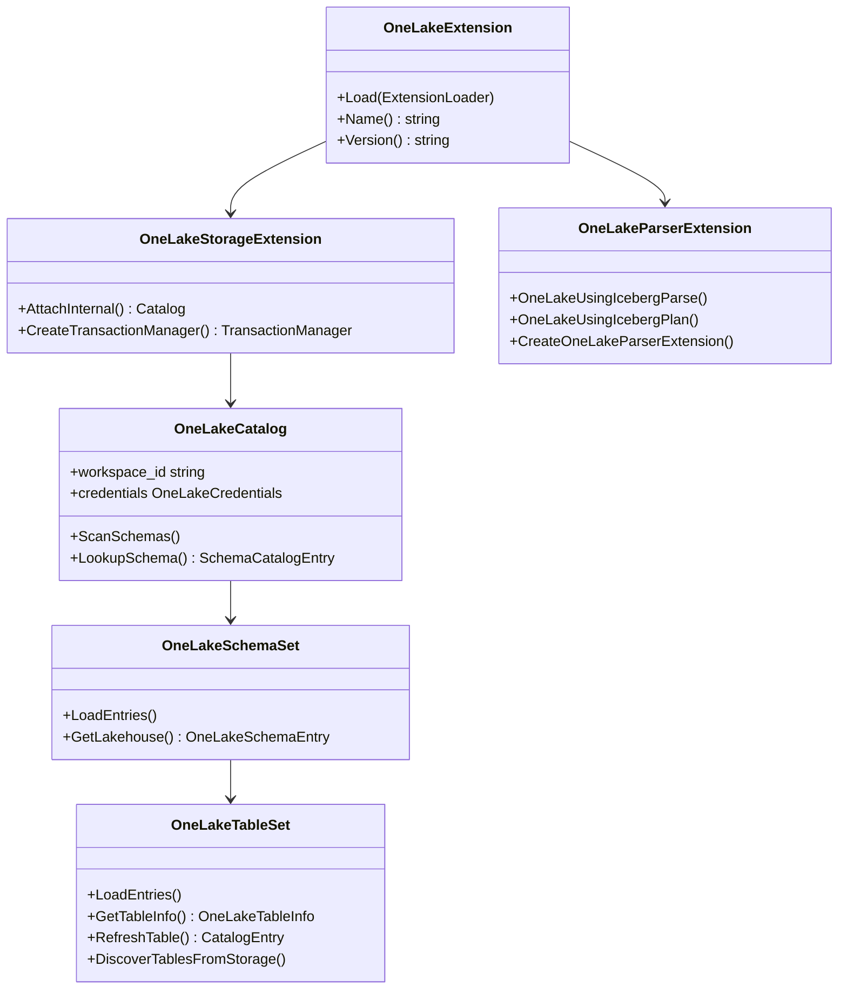
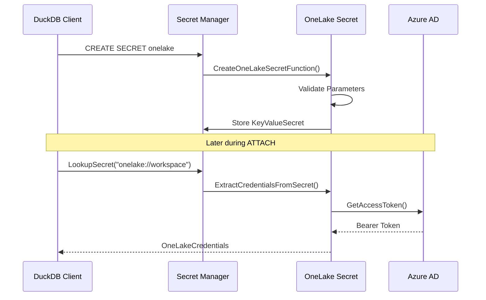
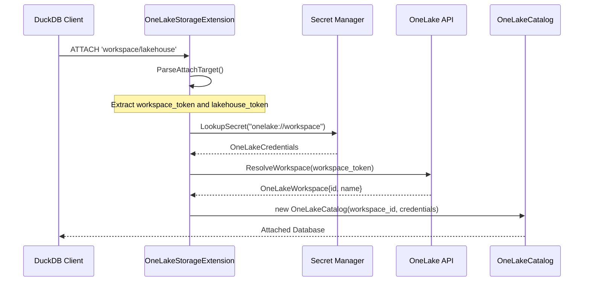
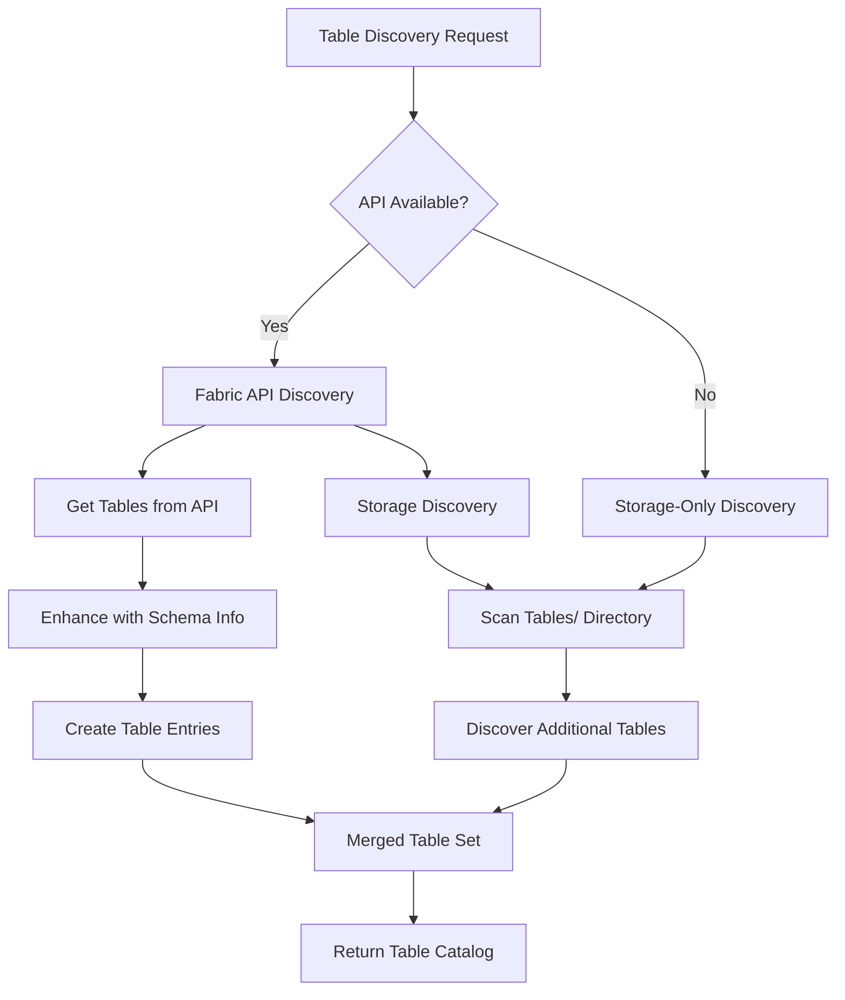
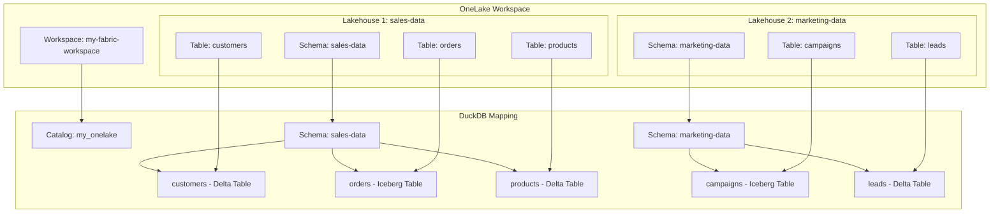
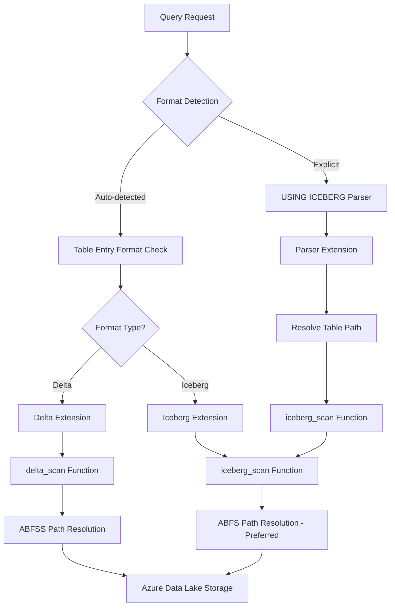
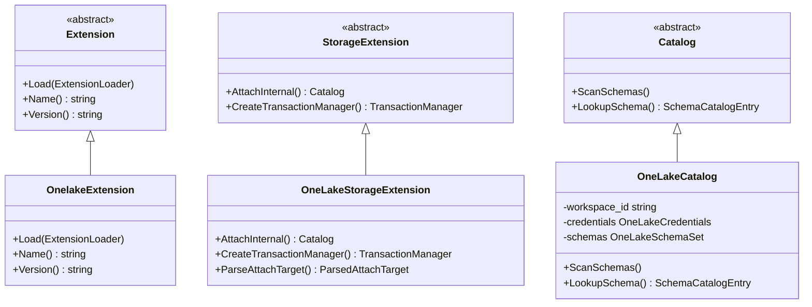
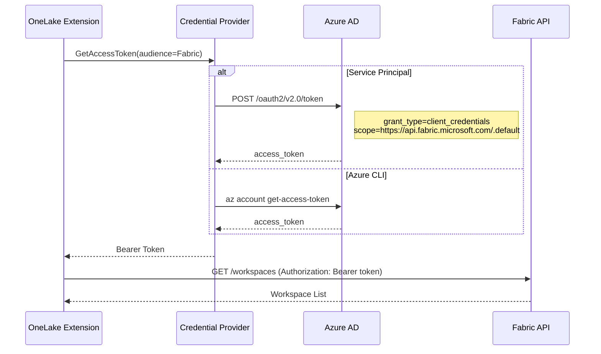
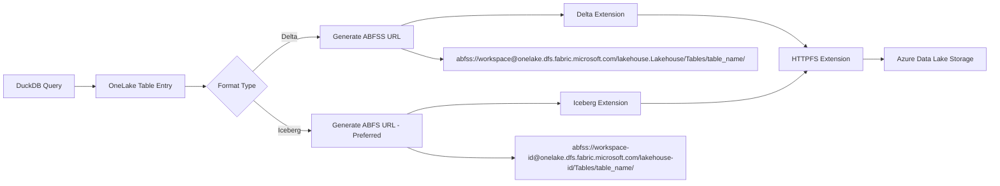

# DuckDB OneLake Extension Documentation

## Table of Contents
- [Overview](#overview)
- [Architecture](#architecture)
- [Authentication System](#authentication-system)
- [Database Attachment Process](#database-attachment-process)
- [Table Discovery and Selection](#table-discovery-and-selection)
- [Apache Iceberg Support](#apache-iceberg-support)
- [Code Reference](#code-reference)
- [API Integration](#api-integration)
- [Limitations and Future Work](#limitations-and-future-work)

## Overview

The DuckDB OneLake extension enables seamless integration between DuckDB and Microsoft Fabric's OneLake, allowing users to query both Delta Lake and Apache Iceberg tables stored in OneLake lakehouses directly from DuckDB. This extension provides a read-only interface to OneLake data, leveraging DuckDB's powerful SQL capabilities while maintaining secure authentication through Azure Active Directory.

### Key Features

- **Multiple Authentication Methods**: Service Principal credentials, Azure CLI authentication, and credential chains
- **Workspace and Lakehouse Management**: Connect to multiple workspaces and lakehouses within a single DuckDB session  
- **Multi-Format Support**: Native integration with both Delta Lake and Apache Iceberg formats
- **Schema Discovery**: Automatic discovery of lakehouses (as schemas) and tables within workspaces
- **Advanced Query Syntax**: Support for explicit format specification with `USING ICEBERG` syntax
- **Secure Access**: Full integration with Azure Active Directory for secure data access



## Architecture

The OneLake extension follows DuckDB's storage extension architecture, implementing a complete catalog system that maps OneLake concepts to DuckDB's catalog hierarchy:

- **Workspace** → **Catalog** (Database)  
- **Lakehouse** → **Schema**
- **Delta Table** → **Table**

### Core Components



### Extension Loading Process

The extension initialization occurs in the following sequence:

```cpp
// From: src/onelake_extension.cpp:12-23
static void LoadInternal(ExtensionLoader &loader) {
    // Register OneLake secret type
    RegisterOneLakeSecret(loader);

    // Register storage extension for catalog functionality
    auto &config = DBConfig::GetConfig(loader.GetDatabaseInstance());
    config.storage_extensions["onelake"] = make_uniq<OneLakeStorageExtension>();
    
    // Register parser extension for USING ICEBERG syntax
    config.parser_extensions.push_back(CreateOneLakeParserExtension());

    // Try to auto-load dependencies used for multi-format access
    ExtensionHelper::TryAutoLoadExtension(loader.GetDatabaseInstance(), "httpfs");
    ExtensionHelper::TryAutoLoadExtension(loader.GetDatabaseInstance(), "delta");
    ExtensionHelper::TryAutoLoadExtension(loader.GetDatabaseInstance(), "iceberg");
}
```

## Authentication System

The OneLake extension supports multiple authentication methods through a flexible credential system that integrates with Azure Active Directory.

### Authentication Methods

#### 1. Service Principal Authentication

The most common authentication method uses Azure AD Service Principal credentials:

```sql
CREATE SECRET onelake (
    TYPE ONELAKE,
    TENANT_ID '<your_tenant_id>',
    CLIENT_ID '<your_client_id>',
    CLIENT_SECRET '<your_client_secret>'
);
```

#### 2. Azure CLI Authentication  

Leverages existing Azure CLI authentication:

```sql
CREATE SECRET onelake (
    TYPE ONELAKE,
    PROVIDER credential_chain,
    CHAIN 'cli'
);
```

#### 3. Credential Chain

Supports multiple authentication fallback mechanisms:

```sql
CREATE SECRET onelake (
    TYPE ONELAKE,
    PROVIDER credential_chain,
    CHAIN 'cli;service_principal;managed_identity'
);
```

### Secret Management Implementation



The secret creation process is handled in the `CreateOneLakeSecretFunction`:

```cpp
// From: src/onelake_secret.cpp:9-40
static unique_ptr<BaseSecret> CreateOneLakeSecretFunction(ClientContext &context, CreateSecretInput &input) {
    auto scope = input.scope;
    if (scope.empty()) {
        scope.push_back("onelake://");
    }

    // Create key-value secret with OneLake credentials
    auto secret = make_uniq<KeyValueSecret>(scope, input.type, input.name, input.storage_type);

    string provider = input.provider.empty() ? "config" : StringUtil::Lower(input.provider);
    
    // Validate required parameters based on provider type
    if (provider == "service_principal") {
        // Validate tenant_id, client_id, client_secret are present
    } else if (provider == "credential_chain") {
        // Validate chain parameter and ensure 'cli' is included
    }
    
    return std::move(secret);
}
```

## Database Attachment Process

The attachment process establishes the connection between DuckDB and a specific OneLake workspace, creating a catalog that maps workspaces to databases and lakehouses to schemas.

### Attachment Syntax Options

```sql
-- Option 1: Workspace ID with default lakehouse
ATTACH 'onelake://workspace-guid' 
    AS my_onelake 
    (TYPE ONELAKE, DEFAULT_LAKEHOUSE 'lakehouse-name');

-- Option 2: Workspace and lakehouse names (resolved automatically)
ATTACH 'workspace-name/lakehouse-name.Lakehouse' 
    AS my_onelake 
    (TYPE ONELAKE);

-- Option 3: Workspace name only
ATTACH 'workspace-name' 
    AS my_onelake 
    (TYPE ONELAKE, DEFAULT_LAKEHOUSE 'lakehouse-name');
```

### Attachment Flow



The attachment process begins in the `AttachInternal` method:

```cpp
// From: src/storage/onelake_storage_extension.cpp:235-260
unique_ptr<Catalog> OneLakeStorageExtension::AttachInternal(
    optional_ptr<StorageExtensionInfo> storage_info,
    ClientContext &context, AttachedDatabase &db,
    const string &name, AttachInfo &info,
    AttachOptions &attach_options) {
    
    // Parse the attachment target to extract workspace and optional lakehouse
    auto parsed_target = ParseAttachTarget(info.path.empty() ? name : info.path);
    string workspace_token = parsed_target.workspace_token;
    
    // Look up appropriate secret based on workspace
    auto &secret_manager = SecretManager::Get(context);
    auto secret_candidate_path = "onelake://" + workspace_token;
    auto secret_match = secret_manager.LookupSecret(
        catalog_transaction, secret_candidate_path, "onelake");
    
    // Extract and validate credentials
    OneLakeCredentials credentials = ExtractCredentialsFromSecret(secret_match.GetSecret());
    
    // Resolve workspace name/ID through API
    OneLakeWorkspace resolved_workspace = ResolveWorkspace(context, credentials, workspace_token);
    
    return make_uniq<OneLakeCatalog>(db, resolved_workspace.id, name, 
                                     std::move(credentials), default_lakehouse);
}
```

### Target Parsing Logic

The extension supports flexible attachment targets through the `ParseAttachTarget` function:

```cpp
// From: src/storage/onelake_storage_extension.cpp:70-120
static ParsedAttachTarget ParseAttachTarget(const string &raw_identifier) {
    string working = raw_identifier;
    
    // Remove optional onelake:// prefix
    const string scope_prefix = "onelake://";
    if (StringUtil::StartsWith(working, scope_prefix)) {
        working = working.substr(scope_prefix.size());
    }
    
    // Parse workspace[/lakehouse] format
    auto slash_pos = working.find('/');
    string workspace_part = working;
    string remainder;
    
    if (slash_pos != string::npos) {
        workspace_part = working.substr(0, slash_pos);
        remainder = working.substr(slash_pos + 1);
        
        // Normalize lakehouse name (remove .Lakehouse suffix if present)
        if (!remainder.empty()) {
            result.lakehouse_token = NormalizeLakehouseToken(remainder);
            result.has_lakehouse = true;
        }
    }
    
    result.workspace_token = workspace_part;
    return result;
}
```

## Table Discovery and Selection

The extension implements a two-phase table discovery mechanism that combines Fabric API calls with direct storage exploration to provide comprehensive table listing.

### Discovery Architecture



### Table Loading Process

The table loading process is implemented in the `OneLakeTableSet::LoadEntries` method:

```cpp
// From: src/storage/onelake_table_set.cpp:158-200
void OneLakeTableSet::LoadEntries(ClientContext &context) {
    auto &onelake_catalog = catalog.Cast<OneLakeCatalog>();
    
    // Get lakehouse ID from schema data
    auto lakehouse_id = schema.schema_data->id;
    auto lakehouse_name = schema.schema_data->name;
    
    // Phase 1: Get tables from OneLake API
    auto &credentials = onelake_catalog.GetCredentials();
    auto tables = OneLakeAPI::GetTables(context, 
                                       onelake_catalog.GetWorkspaceId(), 
                                       lakehouse_id, credentials);
    
    std::unordered_set<string> seen_names;
    idx_t api_count = 0;
    
    // Process API-discovered tables
    for (auto &table : tables) {
        auto table_entry = make_uniq<OneLakeTableEntry>(
            catalog, schema, table.name, table.id, table.format, table.location);
        
        CreateEntry(std::move(table_entry));
        seen_names.insert(StringUtil::Lower(table.name));
        api_count++;
    }
    
    // Phase 2: Discover additional tables from storage
    auto storage_count = DiscoverTablesFromStorage(context, onelake_catalog, 
                                                  schema, *this, seen_names);
}
```

### API-Based Table Discovery

The Fabric API provides structured table metadata through REST endpoints:

```cpp
// From: src/onelake_api.cpp:420-460
vector<OneLakeTable> OneLakeAPI::GetTables(ClientContext &context, 
                                          const string &workspace_id,
                                          const string &lakehouse_id, 
                                          OneLakeCredentials &credentials) {
    vector<OneLakeTable> tables;
    string next_url = BuildAPIUrl(workspace_id, "lakehouses/" + lakehouse_id + "/tables");
    
    while (!next_url.empty()) {
        string response = MakeAPIRequest(context, next_url, credentials, true);
        
        // Parse JSON response
        Json::Value root;
        Json::Reader reader;
        reader.parse(response, root);
        
        // Extract table information
        if (root.isMember("value") && root["value"].isArray()) {
            for (const auto &item : root["value"]) {
                OneLakeTable table;
                table.name = item["name"].asString();
                table.id = item["id"].asString();
                table.format = item["format"].asString();
                table.location = item["location"].asString();
                tables.push_back(table);
            }
        }
        
        // Handle pagination
        next_url = root.isMember("@odata.nextLink") ? 
                   root["@odata.nextLink"].asString() : "";
    }
    
    return tables;
}
```

### Storage-Based Discovery

When API access is limited or to discover tables not yet registered in the API, the extension scans the storage directly:

```cpp
// Storage discovery examines the Tables/ directory structure
// Looking for Delta Lake table directories with _delta_log subdirectories
static idx_t DiscoverTablesFromStorage(ClientContext &context, 
                                       OneLakeCatalog &onelake_catalog,
                                       OneLakeSchemaEntry &schema, 
                                       OneLakeTableSet &table_set,
                                       std::unordered_set<string> &seen_names) {
    
    // Construct ABFSS path for Tables directory
    string tables_path = "abfss://Tables@" + workspace_name + 
                        ".dfs.fabric.microsoft.com/";
    
    // List directory contents
    auto entries = OneLakeAPI::ListDirectory(context, tables_path, credentials);
    
    idx_t count = 0;
    for (const string &entry : entries) {
        // Check if entry looks like a table directory
        if (seen_names.find(StringUtil::Lower(entry)) == seen_names.end()) {
            // Verify it's a valid Delta table by checking for _delta_log
            string delta_log_path = tables_path + entry + "/_delta_log/";
            if (DirectoryExists(context, delta_log_path, credentials)) {
                // Create table entry for discovered table
                auto table_entry = make_uniq<OneLakeTableEntry>(
                    catalog, schema, entry, "", "delta", "Tables/" + entry);
                table_set.CreateEntry(std::move(table_entry));
                count++;
            }
        }
    }
    
    return count;
}
```

### Table Information Retrieval

For each discovered table, the extension can retrieve detailed metadata:

```cpp
// From: src/storage/onelake_table_set.cpp:343-370
unique_ptr<OneLakeTableInfo> OneLakeTableSet::GetTableInfo(ClientContext &context, 
                                                           const string &table_name) {
    // Create table info structure
    auto table_info = make_uniq<OneLakeTableInfo>();
    table_info->name = table_name;
    
    // Default location if not specified
    if (table_info->location.empty()) {
        table_info->location = "Tables/" + table_name;
    }
    
    // Bind through table entry to get schema information
    OneLakeTableEntry temp_entry(catalog, schema, *table_info);
    unique_ptr<FunctionData> temp_bind_data;
    auto table_function = temp_entry.GetScanFunction(context, temp_bind_data);
    
    // Extract column definitions from the binding process
    for (auto &column : temp_entry.GetColumns().Logical()) {
        table_info->create_info->columns.AddColumn(column.Copy());
    }
    
    return table_info;
}
```

### Schema and Table Hierarchy



## Apache Iceberg Support

The OneLake extension provides comprehensive support for Apache Iceberg tables alongside traditional Delta Lake tables. This enables users to query Iceberg tables stored in OneLake lakehouses using either automatic format detection or explicit syntax.

### Iceberg Integration Architecture



### Format Detection Process

The extension automatically detects table formats during discovery by inspecting the storage structure:

```cpp
// From: src/storage/onelake_table_set.cpp:137-163
bool has_delta_log = false;
bool has_iceberg_metadata = false;

// Check for Delta format (_delta_log directory)
if (!has_delta_log) {
    try {
        string delta_dir = root + leaf + "/_delta_log/";
        auto delta_entries = OneLakeAPI::ListDirectory(context, delta_dir, credentials);
        has_delta_log = !delta_entries.empty();
    } catch (const Exception &) {
        has_delta_log = false;
    }
}

// Check for Iceberg format (metadata directory)  
if (!has_delta_log) {
    try {
        string table_root = root + leaf + "/";
        auto child_dirs = OneLakeAPI::ListDirectory(context, table_root, credentials);
        for (auto &child : child_dirs) {
            if (StringUtil::CIEquals(child, "metadata")) {
                has_iceberg_metadata = true;
                break;
            }
        }
    } catch (const Exception &) {
        has_iceberg_metadata = false;
    }
}

string detected_format = has_delta_log ? "Delta" : "iceberg";
```

### Query Syntax Options

#### 1. Automatic Format Detection (Recommended)

Tables are automatically recognized by their format based on storage structure:

```sql
-- Standard catalog access - format auto-detected
SELECT * FROM onelake_catalog.lakehouse_name.table_name;

-- Cross-catalog joins with mixed formats
SELECT d.*, i.* 
FROM onelake_catalog.sales.delta_table d
JOIN onelake_catalog.analytics.iceberg_table i ON d.id = i.ref_id;
```

#### 2. Explicit Iceberg Syntax

For cases requiring explicit format specification or direct table access:

```sql
-- Basic table access
SELECT * FROM table_name USING ICEBERG;

-- Schema-qualified access  
SELECT * FROM lakehouse_name.table_name USING ICEBERG;

-- Fully qualified access
SELECT * FROM catalog_name.lakehouse_name.table_name USING ICEBERG;
```

### Parser Extension Implementation

The `USING ICEBERG` syntax is handled by a dedicated parser extension:

```cpp
// From: src/onelake_parser_extension.cpp:45-70
ParserExtensionParseResult OneLakeUsingIcebergParse(ParserExtensionInfo *, const string &query) {
    auto normalized = TrimmedWithoutSemicolon(query);
    auto upper = StringUtil::Upper(normalized);
    
    const string prefix = "SELECT * FROM ";
    const string suffix = " USING ICEBERG";
    
    if (!StringUtil::StartsWith(upper, prefix) || !StringUtil::EndsWith(upper, suffix)) {
        return ParserExtensionParseResult();
    }
    
    // Extract table identifier between prefix and suffix
    auto identifier = normalized.substr(prefix.size(), 
                                       normalized.size() - prefix.size() - suffix.size());
    
    OneLakeIcebergParseData parse_data;
    if (!TryParseQualifiedName(identifier, parse_data)) {
        return ParserExtensionParseResult();
    }
    
    return ParserExtensionParseResult(std::move(parse_data));
}
```

The parser extension translates `USING ICEBERG` queries into direct `iceberg_scan` function calls with properly constructed ABFSS paths.

### Iceberg Function Integration

The extension dynamically resolves and binds to the DuckDB Iceberg extension:

```cpp
// From: src/storage/onelake_table_entry.cpp:221-236
TableFunction ResolveIcebergFunction(ClientContext &context) {
    auto table_entry = Catalog::GetEntry<TableFunctionCatalogEntry>(
        context, INVALID_CATALOG, DEFAULT_SCHEMA, ICEBERG_FUNCTION_NAME, OnEntryNotFound::RETURN_NULL);
    
    if (!table_entry) {
        ExtensionHelper::AutoLoadExtension(context, "iceberg");
        table_entry = Catalog::GetEntry<TableFunctionCatalogEntry>(
            context, INVALID_CATALOG, DEFAULT_SCHEMA, ICEBERG_FUNCTION_NAME, OnEntryNotFound::RETURN_NULL);
    }
    
    if (!table_entry) {
        throw CatalogException(
            "The 'iceberg' extension is required to query OneLake tables in Iceberg format. "
            "Install it using INSTALL iceberg; then LOAD iceberg;");
    }
    
    return table_entry->functions.GetFunctionByOffset(0);
}
```

### Path Resolution for Iceberg Tables

Iceberg tables use optimized ABFS path resolution that prioritizes native OneLake paths:

```cpp
// From: src/storage/onelake_table_entry.cpp:350-370
if (IsIcebergFormat(table_format)) {
    auto iceberg_function = ResolveIcebergFunction(context);
    
    // Prioritize ABFS paths for better Iceberg compatibility
    auto is_abfs = [](const string &candidate) {
        return StringUtil::StartsWith(candidate, "abfs://") || 
               StringUtil::StartsWith(candidate, "abfss://");
    };
    std::stable_partition(candidate_paths.begin(), candidate_paths.end(), is_abfs);
    
    // Try each path candidate until successful binding
    vector<string> errors;
    for (auto &candidate : candidate_paths) {
        try {
            vector<LogicalType> return_types;
            vector<string> return_names;
            auto iceberg_bind = BindIcebergFunction(context, iceberg_function, 
                                                   candidate, return_types, return_names);
            UpdateColumnDefinitions(return_names, return_types);
            bind_data = std::move(iceberg_bind);
            return iceberg_function;
        } catch (const Exception &ex) {
            errors.push_back(StringUtil::Format("%s (path=%s)", ex.what(), candidate));
        }
    }
}
```

### ABFSS Path Construction

The extension constructs proper ABFSS paths for OneLake Iceberg table access:

```cpp
// From: src/onelake_parser_extension.cpp:17-20
string BuildAbfssPath(const string &workspace_id, const string &lakehouse_id, const string &table_name) {
    return "abfss://" + workspace_id + "@onelake.dfs.fabric.microsoft.com/" + 
           lakehouse_id + "/Tables/" + table_name;
}
```

Path format: `abfss://{workspace-id}@onelake.dfs.fabric.microsoft.com/{lakehouse-id}/Tables/{table-name}`

### Multi-Format Query Examples

```sql
-- Query both Delta and Iceberg tables in same workspace
USE onelake_catalog;

-- Auto-detected formats
SELECT 'Delta' as format, COUNT(*) FROM sales_data.orders_delta
UNION ALL  
SELECT 'Iceberg' as format, COUNT(*) FROM analytics.customer_iceberg;

-- Explicit format specification for clarity
SELECT * FROM customer_data USING ICEBERG 
WHERE region = 'North America';

-- Complex joins across formats
WITH delta_summary AS (
    SELECT product_id, SUM(quantity) as total_qty 
    FROM sales.transactions_delta 
    GROUP BY product_id
),
iceberg_enriched AS (
    SELECT product_id, category, brand 
    FROM catalog.products_iceberg
    WHERE active = true
)
SELECT d.product_id, d.total_qty, i.category, i.brand
FROM delta_summary d
JOIN iceberg_enriched i ON d.product_id = i.product_id;
```

### Error Handling and Dependencies

The Iceberg integration includes comprehensive error handling:

```sql
-- Automatic extension loading
LOAD onelake; -- Automatically attempts to load 'iceberg' extension

-- Manual installation if needed
INSTALL iceberg;
LOAD iceberg;
```

Common error scenarios:
- **Missing Iceberg Extension**: Clear instructions for installation
- **Invalid Table Path**: Multiple path resolution attempts with detailed error reporting  
- **Authentication Issues**: Inherited from main OneLake authentication system
- **Format Conflicts**: Automatic fallback and format detection

## Code Reference

### Key Source Files

#### Extension Entry Point
- **File**: `src/onelake_extension.cpp`
- **Purpose**: Main extension registration and dependency loading
- **Key Functions**:
  - `LoadInternal()`: Registers secrets, storage extension, and dependencies
  - `OnelakeExtension::Load()`: Extension loader interface

#### Storage Extension  
- **File**: `src/storage/onelake_storage_extension.cpp`
- **Purpose**: Implements DuckDB storage extension interface
- **Key Functions**:
  - `AttachInternal()`: Handles ATTACH statement processing
  - `CreateTransactionManager()`: Creates OneLake-specific transaction manager
  - `ParseAttachTarget()`: Parses attachment strings

#### Catalog System
- **File**: `src/onelake_catalog.cpp` 
- **Purpose**: Implements OneLake catalog (workspace) functionality
- **Key Functions**:
  - `OneLakeCatalog()`: Constructor with workspace and credentials
  - `LookupSchema()`: Maps lakehouse names to schema entries
  - `ScanSchemas()`: Enumerates available lakehouses

#### Authentication
- **File**: `src/onelake_secret.cpp`
- **Purpose**: Manages OneLake authentication secrets
- **Key Functions**:
  - `CreateOneLakeSecretFunction()`: Creates and validates secrets
  - `RegisterOneLakeSecret()`: Registers secret type with DuckDB

#### API Integration
- **File**: `src/onelake_api.cpp` 
- **Purpose**: Interfaces with Microsoft Fabric REST APIs
- **Key Functions**:
  - `GetWorkspaces()`: Lists available workspaces
  - `GetLakehouses()`: Lists lakehouses in workspace  
  - `GetTables()`: Lists tables in lakehouse
  - `MakeAPIRequest()`: HTTP client for Fabric APIs

#### Table Management
- **File**: `src/storage/onelake_table_set.cpp`
- **Purpose**: Manages table discovery and metadata
- **Key Functions**:
  - `LoadEntries()`: Discovers tables via API and storage
  - `GetTableInfo()`: Retrieves detailed table metadata
  - `RefreshTable()`: Updates table information
  - `DiscoverTablesFromStorage()`: Multi-format table detection (Delta/_delta_log, Iceberg/metadata)

#### Parser Extension (Iceberg Support)
- **File**: `src/onelake_parser_extension.cpp`
- **Purpose**: Handles `USING ICEBERG` syntax parsing and planning
- **Key Functions**:
  - `OneLakeUsingIcebergParse()`: Parses `SELECT * FROM table USING ICEBERG` syntax
  - `OneLakeUsingIcebergPlan()`: Plans iceberg_scan function calls with ABFSS paths
  - `CreateOneLakeParserExtension()`: Registers parser extension with DuckDB

#### Table Entry (Multi-Format Support)
- **File**: `src/storage/onelake_table_entry.cpp`
- **Purpose**: Handles both Delta and Iceberg table scanning
- **Key Functions**:
  - `ResolveIcebergFunction()`: Auto-loads iceberg extension and resolves iceberg_scan
  - `BindIcebergFunction()`: Binds Iceberg tables with proper ABFSS paths  
  - `IsIcebergFormat()` / `IsDeltaFormat()`: Format detection helpers
  - `GetScanFunction()`: Multi-format scan function resolution with path prioritization

### Class Hierarchy



## API Integration

The extension integrates with Microsoft Fabric APIs to discover and access OneLake resources.

### Authentication Flow



### Fabric API Endpoints

The extension uses these primary Fabric API endpoints:

| Endpoint | Purpose | Implementation |
|----------|---------|----------------|
| `GET /v1/workspaces` | List accessible workspaces | `OneLakeAPI::GetWorkspaces()` |
| `GET /v1/workspaces/{workspaceId}/items` | List items in workspace | Used to find lakehouses |
| `GET /v1/workspaces/{workspaceId}/lakehouses/{lakehouseId}/tables` | List tables in lakehouse | `OneLakeAPI::GetTables()` |
| `GET /v1/workspaces/{workspaceId}/lakehouses/{lakehouseId}/tables/{tableName}` | Get table details | `OneLakeAPI::GetTableInfo()` |

### HTTP Request Implementation

```cpp
// From: src/onelake_api.cpp - HTTP client implementation
static string MakeAPIRequest(ClientContext &context, const string &url, 
                           OneLakeCredentials &credentials, bool expect_json = true) {
    CURL *curl = curl_easy_init();
    string response;
    
    // Set URL and headers
    curl_easy_setopt(curl, CURLOPT_URL, url.c_str());
    
    // Get access token and set authorization header
    string token = GetAccessToken(credentials, OneLakeTokenAudience::Fabric);
    string auth_header = "Authorization: Bearer " + token;
    
    struct curl_slist *headers = nullptr;
    headers = curl_slist_append(headers, auth_header.c_str());
    headers = curl_slist_append(headers, "Content-Type: application/json");
    
    curl_easy_setopt(curl, CURLOPT_HTTPHEADER, headers);
    curl_easy_setopt(curl, CURLOPT_WRITEFUNCTION, WriteCallback);
    curl_easy_setopt(curl, CURLOPT_WRITEDATA, &response);
    
    // Perform request
    CURLcode res = curl_easy_perform(curl);
    
    // Cleanup
    curl_slist_free_all(headers);
    curl_easy_cleanup(curl);
    
    return response;
}
```

### Data Lake Storage Access

For actual table data access, the extension constructs ABFSS URLs and delegates to appropriate format extensions:



The ABFSS URL construction follows these patterns:

**Delta Tables (Legacy format)**:
```
abfss://{workspace-name}@onelake.dfs.fabric.microsoft.com/{lakehouse-name}.Lakehouse/Tables/{table-name}/
```

**Iceberg Tables (Optimized format)**:
```
abfss://{workspace-id}@onelake.dfs.fabric.microsoft.com/{lakehouse-id}/Tables/{table-name}/
```

The Iceberg integration prioritizes native ABFS paths for better compatibility with the Iceberg format specification.

## Limitations and Future Work

### Current Limitations

1. **Read-Only Access**: The extension currently only supports SELECT operations
   - No INSERT, UPDATE, DELETE, or CREATE TABLE support
   - Implementation in `OneLakeCatalog` throws `NotImplementedException` for these operations

2. **Schema-Enabled Lakehouses**: Currently incompatible due to Fabric API limitations
   - See: [Lakehouse Schemas Public Preview Limitations](https://learn.microsoft.com/en-us/fabric/data-engineering/lakehouse-schemas#public-preview-limitations)

3. **Limited Format Support**: Currently supports Delta Lake and Apache Iceberg
   - Parquet and other formats not directly supported
   - Relies on DuckDB's delta and iceberg extensions for format handling

4. **Limited Metadata**: Some table metadata may not be available through current APIs
   - Table size, row counts, and statistics may be incomplete

### Future Enhancements

#### Write Operations Support
```sql
-- Potential future functionality
INSERT INTO onelake.lakehouse.table SELECT * FROM local_table;
CREATE TABLE onelake.lakehouse.new_table AS SELECT * FROM source;
UPDATE onelake.lakehouse.table SET column = value WHERE condition;
```

#### Enhanced Authentication
- Managed Identity support for Azure-hosted environments
- Interactive authentication flows
- Certificate-based authentication

#### Performance Optimizations
- Connection pooling for API requests
- Metadata caching with TTL
- Parallel table discovery
- Predicate pushdown optimization

#### Extended Format Support
- Direct Parquet table support
- CSV file access within lakehouses  
- JSON data file support
- Hudi table format integration
- Mixed format query optimization

### Error Handling and Reliability

The extension implements comprehensive error handling:

```cpp
// Example error handling patterns from the codebase
try {
    auto tables = OneLakeAPI::GetTables(context, workspace_id, lakehouse_id, credentials);
} catch (const std::exception &e) {
    // Fallback to storage-based discovery
    if (detail_endpoint_supported) {
        detail_endpoint_supported = false;
        // Log warning and continue with alternative approach
    }
}
```

Common error scenarios handled:
- Network connectivity issues
- Authentication token expiration
- API rate limiting  
- Workspace/lakehouse access permissions
- Malformed table metadata

This comprehensive documentation provides a complete understanding of the DuckDB OneLake extension's architecture, functionality, and implementation details. The extension serves as a bridge between DuckDB's powerful analytical capabilities and Microsoft Fabric's OneLake data platform, enabling seamless data analysis workflows.